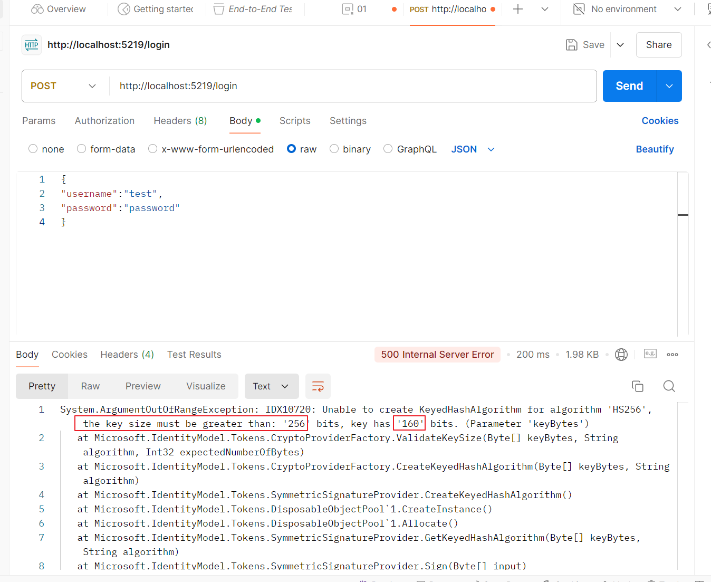
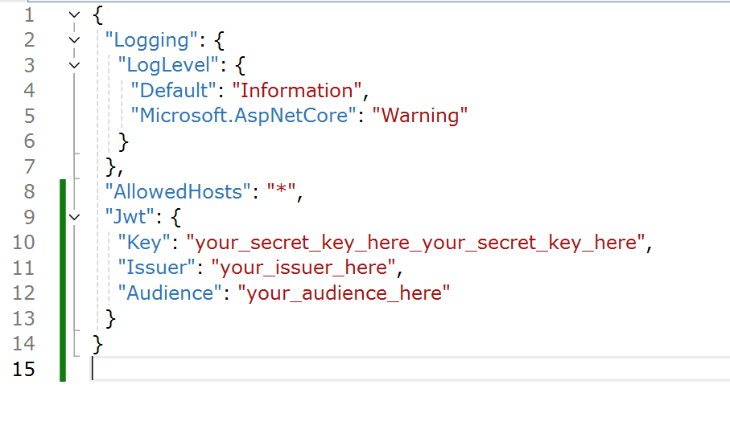
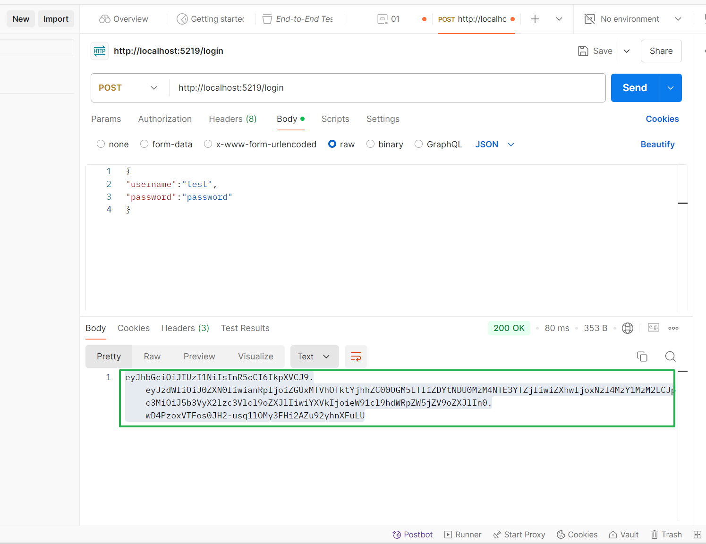
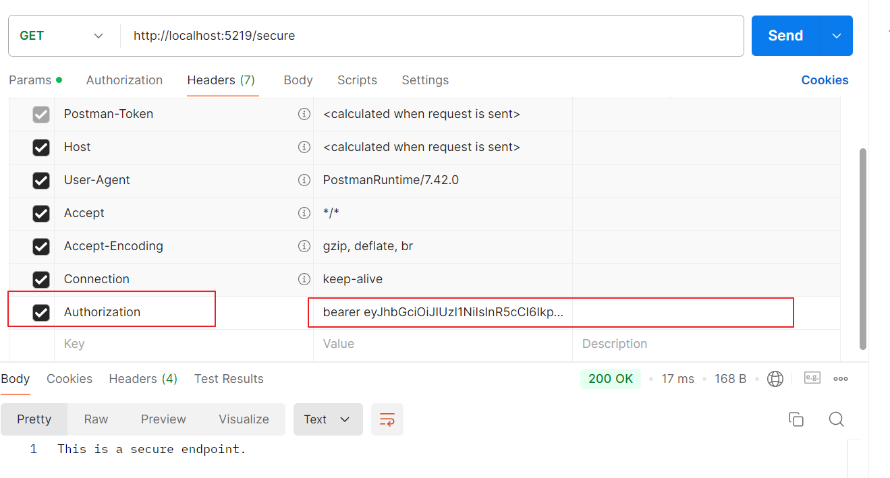
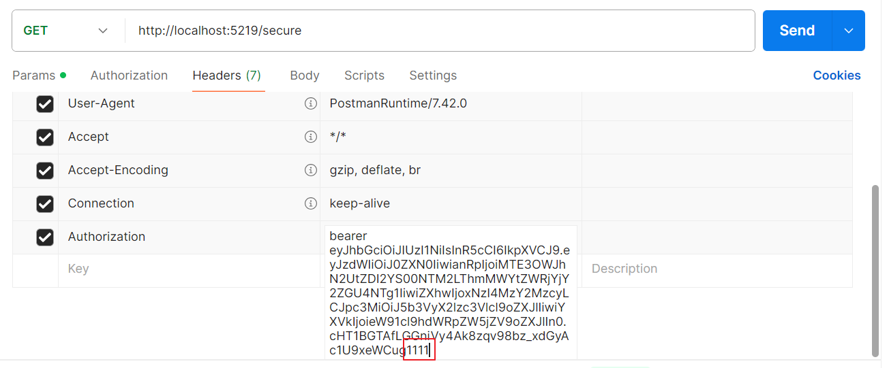
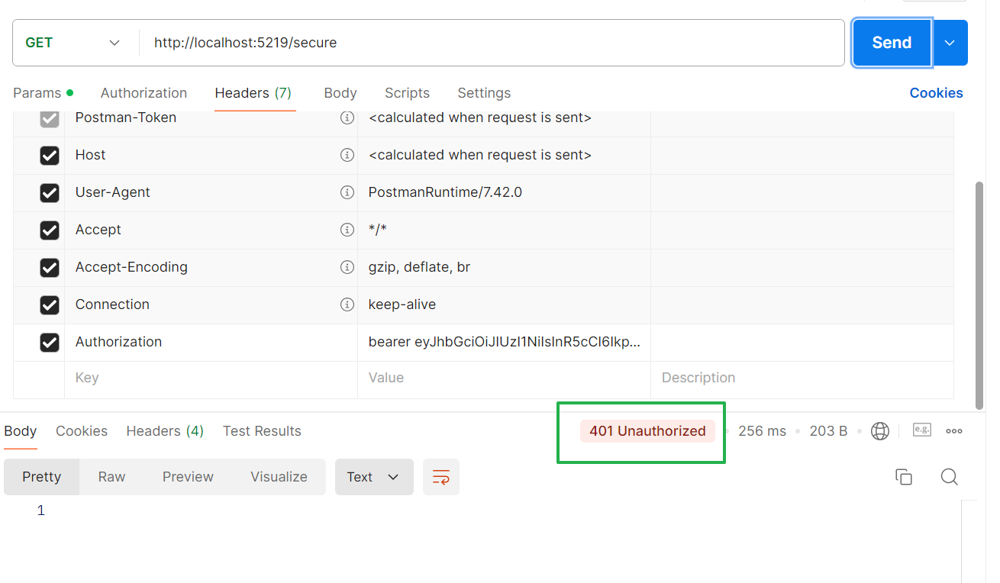
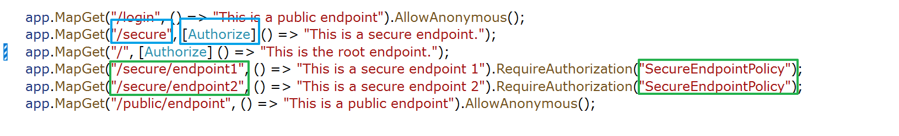

# 說明
    因為本實驗要清楚其底層運作，故不使用網頁，改用**POSTMAN**工具來詳細檢視驗證及授權的過程。
    
# 設置重點提示
在專案的appsettings.json 中，在JWT 中的KEY 宣告自己的KEY種子


# 驗證方式
-  使用**POSTMAN**工具，在**POST** 的 **Body**頁籤中，將正確的 username及password 使用JASON 方式輸入 
-  送出後，收到500錯誤。提示種子至少要256 bit，我們只有160 bit (20個字)



- 我們加字，再重新執行程式。再用POSTMAN 重新發送請求，程式比對username 及  password 都正確，就會返回 JWT Token


**JWT Token** 就是下圖綠色圈起來的文字


- 接下來，我們要確認**驗證**是否發揮作用。程式裡宣告要訪問 **/secure** 這個路徑是必須經過授權的，於是我們用**GET**訪問 **/secure**。得到**200 OK**.   


- 接下來，我們故意弄亂Token 再重新發送。會得到 **401 unauthorized 錯誤**(未被授權).由此可知，若沒通過認證取得授權，是無法訪問加鎖的頁面的。




- 但是，若我們套用了特定策略:
```
options.AddPolicy("SecureEndpointPolicy", policy =>
    policy.RequireRole("SecureRole"));
```
仔細驗證後可以發現當路徑宣告為** [Authorize]**(下圖藍色部分)，只要帳號密碼通過，即可訪問，不再須要附上Token。但是若宣告為 **RequireAuthorization("SecureEndpointPolicy")**(下圖綠色部分)，則表示須符合特定Policy，頁面一定要附上Token，才能訪問。

